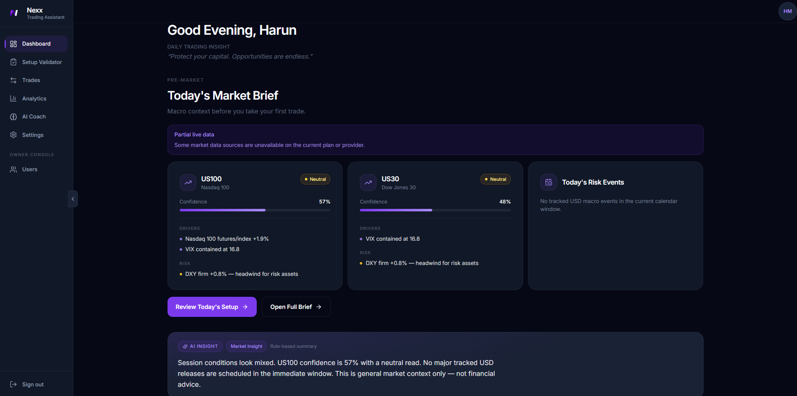
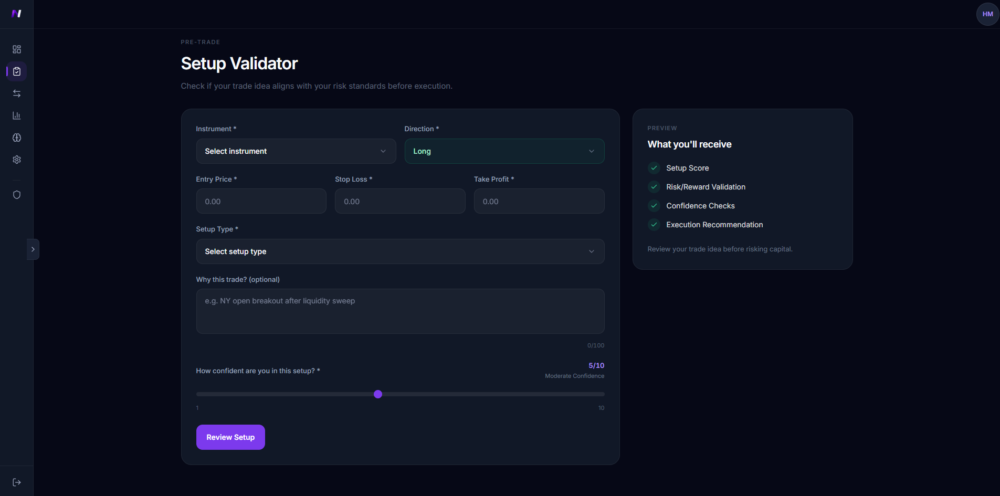
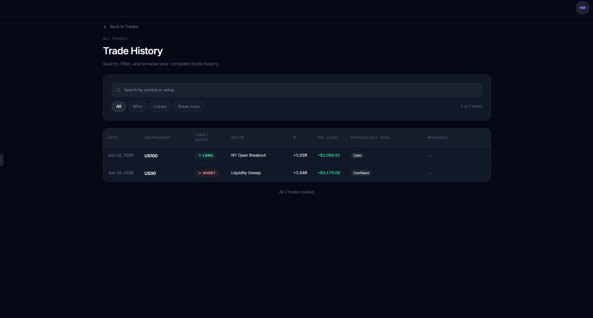
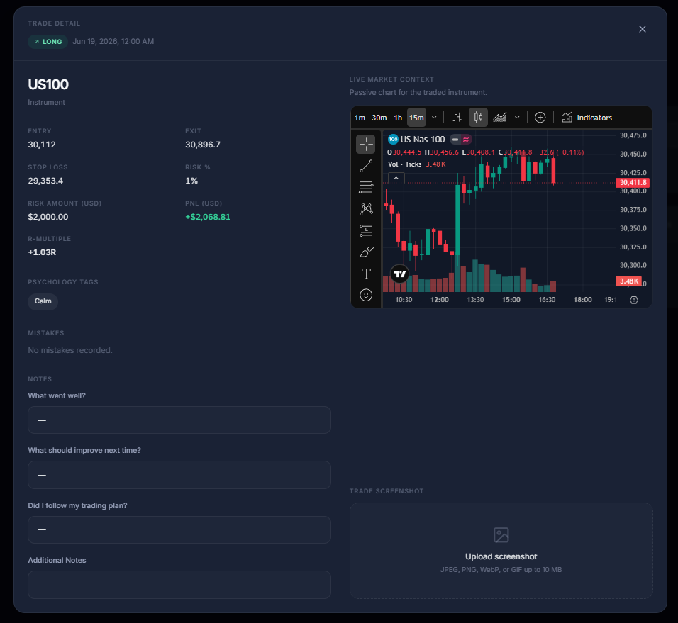
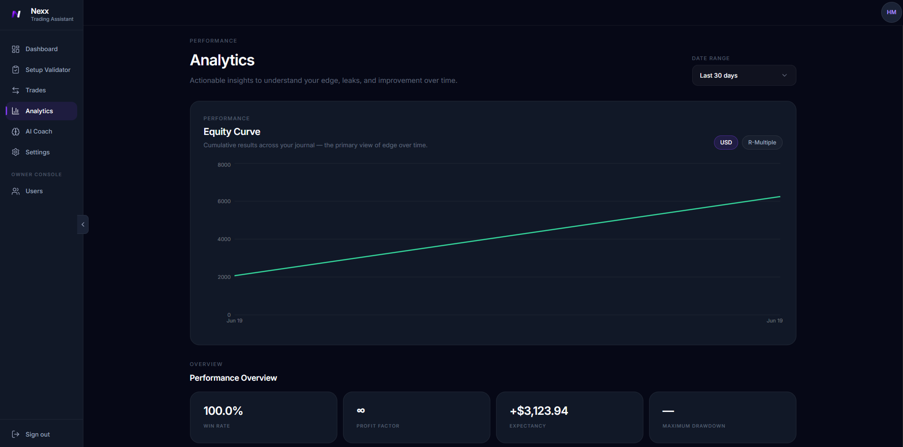
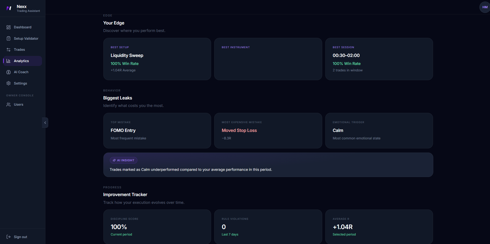

# Nexx Trading Journal

A modern trading assistant built to help traders prepare better, execute with confidence and improve through structured review.

> Source code is private and not publicly available. This repository serves as a public product showcase.

<h2>Application Preview</h2>

  
  

  
  

  
  

## Overview

Nexx Trading Journal is a full-stack trading platform designed for traders who want more than a simple journal.

The platform combines pre-market preparation, setup validation, trade execution tracking, performance analytics and behavioral coaching into a single workflow.

Instead of relying on scattered notes, spreadsheets and screenshots, traders can manage their entire process from preparation to review in one place.

## The Problem

Many traders struggle with consistency.

Trade ideas are often based on emotion rather than process, journaling happens after mistakes have already been made, and valuable performance data gets lost across multiple tools.

Without structure, it becomes difficult to identify weaknesses, improve execution and build long-term discipline.

## The Solution

Nexx provides a complete trading workflow built around one principle:

**Prepare → Validate → Execute → Review → Improve**

From pre-market analysis to post-session coaching, every feature is designed to help traders make better decisions and develop consistent habits.

## Key Features

### Pre-Market Preparation

* Market Brief with macro context
* Economic Calendar integration
* AI-generated market insights
* Daily readiness and discipline tracking

### Pre-Trade Validation

* Setup Validator
* Execution Signals
* Rule-based trade scoring
* Risk awareness and macro-event checks

### Trade Management

* Structured trade logging
* Screenshot journaling
* Psychology tagging
* Mistake tracking
* R-Multiple and performance calculations

### Performance Review

* Analytics dashboard
* Equity curve tracking
* Performance calendar
* AI coaching insights
* Discipline scoring system

### Platform Experience

* Progressive Web App (PWA)
* Mobile-first responsive interface
* TradingView integration
* Dark-mode optimized workspace
